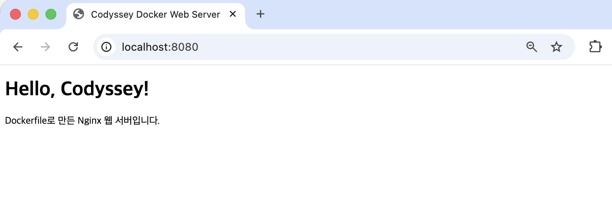
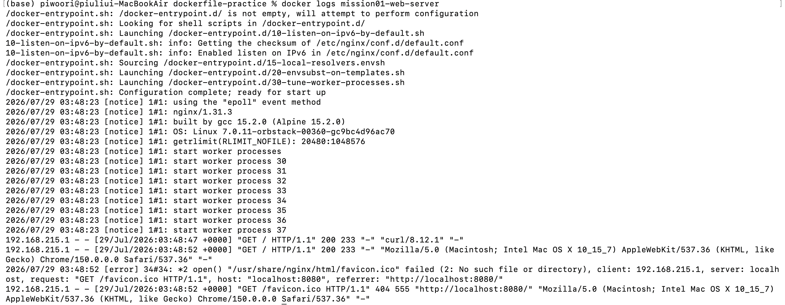
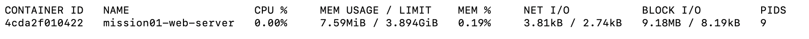
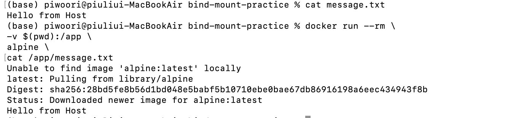
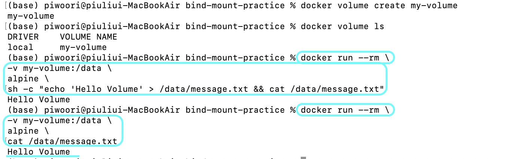

## 1. 프로젝트 소개

본 프로젝트는 Linux 터미널, Docker, Git/GitHub의 기본 사용법을 학습하기 위한 개발 환경 구축 실습이다.

터미널 명령어, 파일 권한, Docker 이미지 및 컨테이너 생성, Bind Mount, Docker Volume 등을 실습하고 README를 통해 수행 과정을 기록하였다.

## 2. 개발 환경

| 항목 | 내용 |
|------|------|
| OS | macOS |
| CPU | Apple Silicon (M1) |
| Container Runtime | OrbStack |
| Docker | 29.4.0 |
| Git | 2.50.1 |

## 3. 수행 체크리스트

- [x] 터미널 명령어 실습
- [x] 파일 권한 변경
- [x] Docker 설치
- [x] Hello World 실행
- [x] Dockerfile 작성
- [x] 사용자 정의 이미지 생성
- [x] Bind Mount 실습
- [x] Docker Volume 실습
- [x] Git 커밋 및 GitHub Push

## 4. 터미널 기본 조작

터미널을 이용하여 현재 경로와 파일 목록을 확인하고, 디렉터리와 파일을 생성·복사·이동·삭제하였다.

### 4.1 현재 경로 및 파일 목록 확인

현재 작업 중인 디렉터리를 확인하였다.

```bash
pwd
```

실행 결과

```text
/Users/piwoori/Codyssey/mission01-dev-workstation
```

숨김 파일을 포함한 전체 파일 목록을 확인하였다.

```bash
ls -la
```

`ls`는 현재 디렉터리의 파일과 디렉터리 목록을 출력한다.
`-l` 옵션은 권한, 소유자, 크기 등의 상세 정보를 표시하고, `-a` 옵션은 숨김 파일을 포함하여 표시한다.

### 4.2 디렉터리 생성 및 이동

터미널 실습을 위한 디렉터리를 생성하였다.

```bash
mkdir -p terminal-practice/original
```

`mkdir`는 디렉터리를 생성하는 명령어이며, `-p` 옵션을 사용하면 상위 디렉터리가 존재하지 않아도 함께 생성할 수 있다.

생성한 디렉터리로 이동하였다.

```bash
cd terminal-practice
pwd
```

실행 결과

```text
/Users/piwoori/Codyssey/mission01-dev-workstation/terminal-practice
```

`cd`는 현재 작업 디렉터리를 다른 디렉터리로 변경하는 명령어이다.

### 4.3 파일 생성 및 내용 확인

`touch` 명령어를 이용하여 빈 파일을 생성하였다.

```bash
touch empty.txt
```

`echo`와 출력 리다이렉션을 이용하여 문자열이 저장된 파일을 생성하였다.

```bash
echo "Docker workstation practice" > original/sample.txt
```

파일 내용을 확인하였다.

```bash
cat original/sample.txt
```

실행 결과

```text
Docker workstation practice
```

`cat`은 파일의 내용을 터미널에 출력하는 명령어이다.

### 4.4 파일 복사, 이름 변경 및 이동

파일을 복사하였다.

```bash
cp original/sample.txt copied.txt
```

복사된 파일의 이름을 변경하였다.

```bash
mv copied.txt renamed.txt
```

파일을 보관할 디렉터리를 생성하고, 이름을 변경한 파일을 이동하였다.

```bash
mkdir backup
mv renamed.txt backup/
```

`cp`는 파일 또는 디렉터리를 복사하고, `mv`는 파일의 이름을 변경하거나 다른 위치로 이동할 때 사용한다.

### 4.5 파일 및 디렉터리 삭제

이동한 파일을 삭제하였다.

```bash
rm backup/renamed.txt
```

빈 디렉터리를 삭제하였다.

```bash
rmdir backup
```

`rm`은 파일을 삭제하고, `rmdir`은 비어 있는 디렉터리를 삭제한다.

### 4.6 절대 경로와 상대 경로

절대 경로는 파일 시스템의 최상위 위치부터 대상까지의 전체 경로를 나타낸다.

```text
/Users/piwoori/Codyssey/mission01-dev-workstation/terminal-practice
```

상대 경로는 현재 작업 중인 디렉터리를 기준으로 대상의 위치를 나타낸다.

```text
original/sample.txt
```

현재 디렉터리가 `terminal-practice`일 때 `original/sample.txt`는 현재 위치를 기준으로 `original` 디렉터리 내부의 `sample.txt` 파일을 의미한다.

### 4.7 실행 증거

터미널 명령어와 출력 결과는 아래 이미지에서 확인할 수 있다.


## 5. 파일 및 디렉터리 권한

파일과 디렉터리의 권한을 확인하고 변경하여 Linux 권한 체계를 실습하였다.

### 5.1 파일 권한 확인

먼저 `ls -l` 명령어를 이용하여 파일의 권한을 확인하였다.

```bash
ls -l empty.txt
```

실행 결과

```text
-rw-r--r--  1 piwoori  staff  0  7월 28 19:30 empty.txt
```

`-rw-r--r--`은 소유자는 읽기(r), 쓰기(w)가 가능하고, 그룹과 다른 사용자는 읽기(r)만 가능함을 의미한다.

### 5.2 파일 권한 변경

먼저 소유자만 읽기와 쓰기가 가능하도록 권한을 변경하였다.

```bash
chmod 600 empty.txt
ls -l empty.txt
```

실행 결과

```text
-rw-------  1 piwoori  staff  0  7월 28 19:30 empty.txt
```

이후 다시 일반적인 파일 권한인 `644`로 변경하였다.

```bash
chmod 644 empty.txt
ls -l empty.txt
```

실행 결과

```text
-rw-r--r--  1 piwoori  staff  0  7월 28 19:30 empty.txt
```

마지막으로 실행 권한을 포함한 `755` 권한으로 변경하였다.

```bash
chmod 755 empty.txt
ls -l empty.txt
```

실행 결과

```text
-rwxr-xr-x  1 piwoori  staff  0  7월 28 19:30 empty.txt
```

### 5.3 디렉터리 권한 변경

디렉터리의 현재 권한을 확인하였다.

```bash
ls -ld original
```

실행 결과

```text
drwxr-xr-x  3 piwoori  staff  96  7월 28 19:31 original
```

소유자만 접근 가능하도록 권한을 변경하였다.

```bash
chmod 700 original
ls -ld original
```

실행 결과

```text
drwx------  3 piwoori  staff  96  7월 28 19:31 original
```

실습 후 일반적인 디렉터리 권한인 `755`로 복구하였다.

```bash
chmod 755 original
ls -ld original
```

실행 결과

```text
drwxr-xr-x  3 piwoori  staff  96  7월 28 19:31 original
```

### 5.4 권한 표기 이해

Linux 권한은 읽기(Read), 쓰기(Write), 실행(Execute) 권한의 조합으로 표현된다.

| 권한 | 의미 | 숫자 |
|------|------|------|
| r | 읽기(Read) | 4 |
| w | 쓰기(Write) | 2 |
| x | 실행(Execute) | 1 |

숫자 권한은 각 권한의 값을 더하여 표현한다.

- 7 = 4 + 2 + 1 = rwx
- 6 = 4 + 2 = rw-
- 5 = 4 + 1 = r-x
- 4 = 4 = r--

예를 들어,

- `644` → `rw-r--r--`
- `755` → `rwxr-xr-x`
- `700` → `rwx------`

을 의미한다.

### 5.5 실행 증거

아래 이미지는 파일 및 디렉터리 권한을 확인하고 변경한 실행 결과이다.


## 6. Docker 설치 및 환경 확인

macOS 환경에서 OrbStack을 이용하여 Docker를 설치하였다.

OrbStack은 Docker Engine을 포함하고 있어 Docker Desktop 없이 Docker CLI를 사용할 수 있다.

설치 후 `docker --version`과 `docker info` 명령어를 실행하여 Docker Engine이 정상적으로 실행되는 것을 확인하였다.

```bash
docker --version
docker info
```

### 6.1 실행 증거


## 7. Docker Hello World 실행

Docker가 정상적으로 동작하는지 확인하기 위해 `hello-world` 이미지를 실행하였다.

### 7.1 이미지 실행

```bash
docker run hello-world
```

실행 결과

```text
Hello from Docker!
This message shows that your installation appears to be working correctly.
```

### 7.2 컨테이너 확인

```bash
docker ps -a
```

`docker ps -a`를 실행한 결과, `hello-world` 컨테이너가 생성된 것을 확인하였다.

### 7.3 이미지 확인

```bash
docker images
```

`docker images`를 실행한 결과, 처음 실행 시 Docker Hub에서 `hello-world` 이미지를 자동으로 다운로드(Pull)한 뒤 컨테이너를 생성하고 실행한 것을 확인하였다.

### 7.4 실행 증거


## 8. Dockerfile을 이용한 웹 서버 이미지 생성

Dockerfile은 Docker 이미지를 생성하기 위한 설정 파일이다.

기존 `nginx:alpine` 이미지를 기반으로 사용자 정의 웹 서버 이미지를 생성하고, 컨테이너를 실행하여 브라우저에서 정상적으로 접속되는 것을 확인하였다.

### 8.1 Dockerfile 작성

```dockerfile
FROM nginx:alpine

LABEL org.opencontainers.image.title="mission01-web-server"

COPY site/ /usr/share/nginx/html/

EXPOSE 80
```

- `FROM nginx:alpine`: Nginx 웹 서버가 포함된 이미지를 기반으로 사용하였다.
- `LABEL`: 이미지 정보를 추가하였다.
- `COPY site/ /usr/share/nginx/html/`: 직접 작성한 웹 페이지를 Nginx 기본 웹 경로에 복사하였다.
- `EXPOSE 80`: 컨테이너가 사용하는 웹 서버 포트를 명시하였다.

### 8.2 이미지 빌드

```bash
docker build -t mission01-web:1.0 .
```

`-t` 옵션을 이용하여 이미지 이름을 `mission01-web:1.0`으로 지정하고 현재 디렉터리의 Dockerfile을 이용해 이미지를 빌드하였다.

### 8.3 컨테이너 실행 및 포트 매핑

```bash
docker run -d --name mission01-web-server -p 8080:80 mission01-web:1.0
```

- `-d`: 백그라운드에서 컨테이너를 실행한다.
- `--name`: 컨테이너 이름을 `mission01-web-server`로 지정하였다.
- `-p 8080:80`: 호스트의 8080번 포트와 컨테이너의 80번 포트를 연결하였다.

### 8.4 생성 결과 확인

```bash
docker ps
docker images
```

생성한 `mission01-web:1.0` 이미지와 `mission01-web-server` 컨테이너가 정상적으로 생성 및 실행된 것을 확인하였다.

### 8.5 웹 서버 접속 확인

브라우저에서 `http://localhost:8080`으로 접속하여 웹 페이지가 정상적으로 출력되는 것을 확인하였다.



### 8.6 컨테이너 로그 및 리소스 확인

```bash
docker logs mission01-web-server
```

브라우저 접속 후 `GET / HTTP/1.1` 요청이 기록되는 것을 확인하였다.



```bash
docker stats mission01-web-server
```

컨테이너의 CPU, 메모리, 네트워크 사용량 등 리소스 정보를 확인하였다.



## 9. Bind Mount 실습

호스트(macOS)의 디렉터리를 컨테이너 내부에 연결하여 동일한 파일을 공유하는 Bind Mount를 실습하였다.

### 9.1 파일 생성

호스트에서 읽어 들일 메시지 파일을 생성하였다.

```bash
echo "Hello from Host" > message.txt
```

### 9.2 Bind Mount란?

Bind Mount는 **호스트(macOS)의 특정 디렉터리를 컨테이너 내부와 직접 연결하는 기능**이다.

이번 실습에서는 현재 디렉터리를 컨테이너의 `/app` 디렉터리에 연결하여, 호스트의 `message.txt` 파일을 컨테이너 내부에서 그대로 읽을 수 있음을 확인하였다.

```bash
docker run --rm \
-v $(pwd):/app \
alpine \
cat /app/message.txt
```

옵션 설명

- `--rm` : 컨테이너 종료 시 자동 삭제
- `-v $(pwd):/app` : 현재 디렉터리를 컨테이너의 `/app` 디렉터리에 연결
- `alpine` : 실행할 Docker 이미지
- `cat /app/message.txt` : 컨테이너 내부에서 파일 내용 출력

실행 결과

```text
Hello from Host
```

호스트에 있는 `message.txt`를 컨테이너 내부 `/app/message.txt`에서 동일하게 읽을 수 있음을 확인하였다.

### 9.3 실행 증거



## 10. Docker Volume 실습

Docker Volume을 생성하여 컨테이너 간 데이터를 유지하는 방법을 실습하였다.

### 10.1 Volume 생성

```bash
docker volume create my-volume
```

생성된 Volume을 확인하였다.

```bash
docker volume ls
```

### 10.2 Volume에 데이터 저장

생성한 Volume에 데이터를 저장하였다.

```bash
docker run --rm \
-v my-volume:/data \
alpine \
sh -c "echo 'Hello Volume' > /data/message.txt && cat /data/message.txt"
```

실행 결과

```text
Hello Volume
```

### 10.3 데이터 유지 확인

새로운 컨테이너에서 동일한 Volume을 연결하여 저장된 데이터를 확인하였다.

```bash
docker run --rm \
-v my-volume:/data \
alpine \
cat /data/message.txt
```

실행 결과

```text
Hello Volume
```

### 10.4 Volume과 Bind Mount의 차이

두 방식은 데이터를 저장한다는 공통점이 있지만 관리 방식과 사용 목적에 차이가 있다.

| Bind Mount | Docker Volume |
|------------|---------------|
| 호스트의 특정 디렉터리를 직접 연결 | Docker가 데이터를 직접 관리 |
| 호스트 파일 구조에 의존 | Docker 내부에서 독립적으로 관리 |
| 개발 중 소스코드 공유에 적합 | 데이터 영속성(DB, 업로드 파일 등)에 적합 |

### 10.5 실행 증거



## 11. Git/GitHub

Git을 이용하여 작업 단위별로 커밋을 수행하고 GitHub 원격 저장소에 Push하였다.

### 11.1 Git 명령어

```bash
git add .
git commit -m "docs: complete mission01"
git push origin main
```

## 12. 트러블슈팅

### 12.1 Docker 이미지 자동 다운로드

- **문제**
    - `hello-world` 이미지를 직접 다운로드하지 않았는데 `docker run hello-world` 명령어가 정상적으로 실행되었다.

- **원인**
    - Docker는 실행하려는 이미지가 로컬에 없으면 Docker Hub에서 자동으로 이미지를 다운로드(Pull)한 뒤 컨테이너를 생성한다.

- **해결**
  ```bash
  docker run hello-world
  ```

- **배운 점**
    - `docker run` 명령어는 이미지 다운로드(Pull), 컨테이너 생성(Create), 실행(Start) 과정을 자동으로 수행한다.

### 12.2 Dockerfile 빌드 오류

- **문제**
    - `docker build` 명령어를 실행했지만 Dockerfile을 찾지 못해 빌드가 실패하였다.

- **원인**
    - Dockerfile이 있는 디렉터리가 아닌 다른 위치에서 명령어를 실행하였다.

- **해결**
  ```bash
  cd dockerfile-practice
  docker build -t my-first-image .
  ```

- **배운 점**
    - `docker build`의 마지막 `.`은 현재 디렉터리(Context)를 의미하며, Dockerfile이 존재하는 위치에서 실행해야 한다.

### 12.3 Bind Mount와 Docker Volume의 차이

- **문제**
    - 처음에는 Bind Mount와 Docker Volume의 차이를 명확하게 이해하지 못하였다.

- **원인**
    - 두 기능 모두 데이터를 저장하는 기능이라고만 생각하였다.

- **해결**
    - Bind Mount와 Docker Volume을 각각 실습하여 동작 방식을 비교하였다.

- **배운 점**
    - Bind Mount는 호스트 디렉터리를 직접 연결하는 방식이며, Docker Volume은 Docker가 관리하는 별도의 저장 공간이라는 차이가 있다.

## 13. 느낀 점

이번 미션을 통해 Linux 터미널 명령어를 직접 사용하며 개발 환경을 구성하는 과정을 경험할 수 있었다. 평소에는 IDE를 주로 사용했지만, 터미널 명령어만으로도 파일과 디렉터리를 관리할 수 있다는 점을 알게 되었다.

또한 Docker를 이용하여 이미지를 생성하고 컨테이너를 실행하는 과정을 실습하면서 컨테이너 기술의 기본 개념과 동작 방식을 이해할 수 있었다. 특히 Dockerfile을 이용한 이미지 생성과 Bind Mount, Docker Volume의 차이를 직접 확인하면서 각각의 활용 목적을 명확하게 이해할 수 있었다.

마지막으로 Git과 GitHub를 이용해 작업 내용을 관리하며 버전 관리의 중요성을 다시 한번 느꼈다. 앞으로도 개발 과정과 결과를 꾸준히 기록하고 관리하는 습관을 기르고, 재현 가능한 개발 환경을 구성할 수 있도록 지속적으로 학습할 계획이다.
