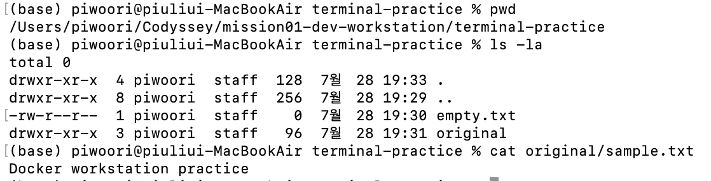
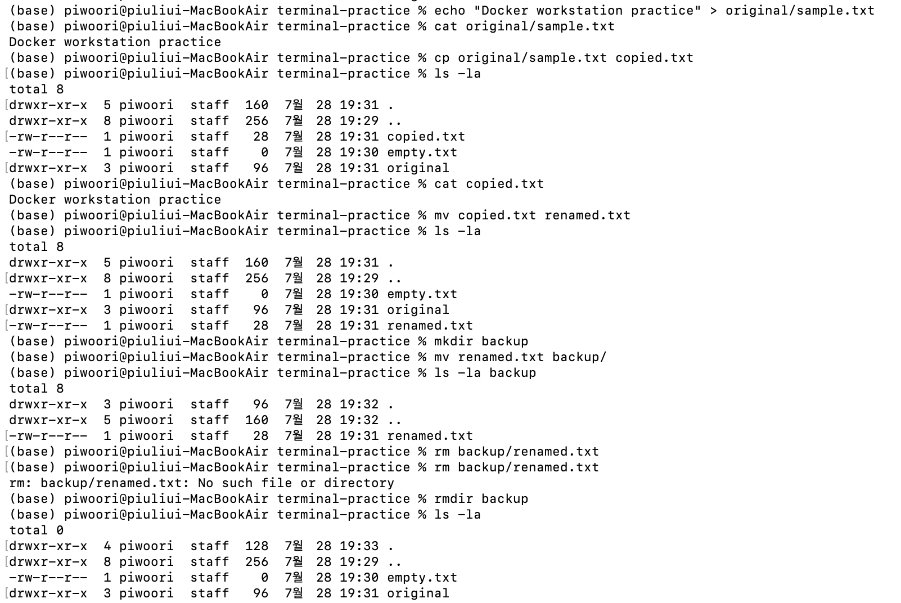
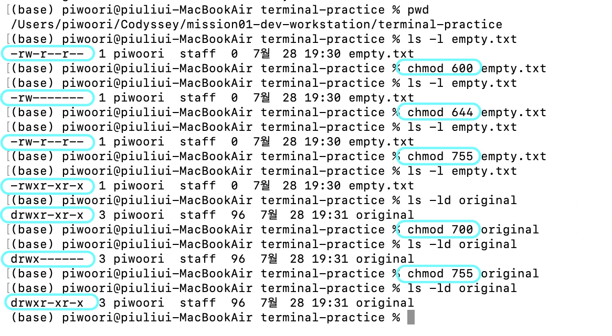
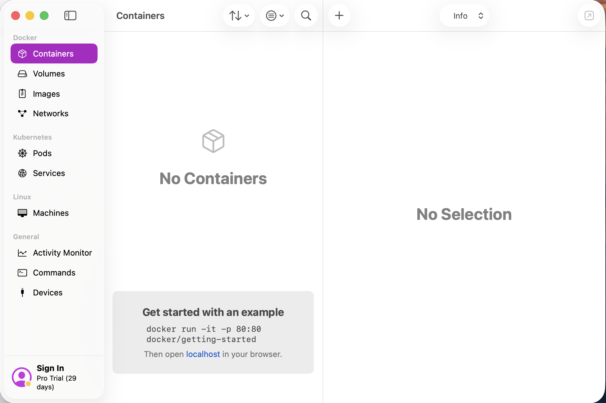
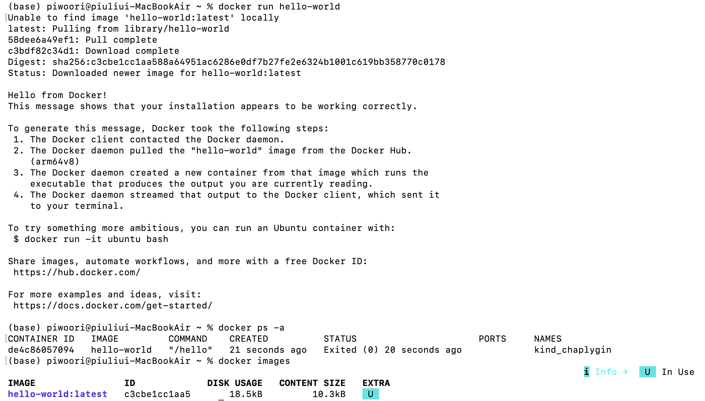

README.md

1. 프로젝트 소개

2. 개발 환경

3. 수행 체크리스트

## 4. 터미널 기본 조작

터미널을 이용하여 현재 경로와 파일 목록을 확인하고, 디렉터리와 파일을 생성·복사·이동·삭제하였다.

### 4.1 현재 경로 및 파일 목록 확인

현재 작업 중인 디렉터리를 확인하였다.

```bash
pwd
```

실행 결과:

```text
/Users/piwoori/Codyssey/mission01-dev-workstation
```

숨김 파일을 포함한 전체 파일 목록을 확인하였다.

```bash
ls -la
```

`ls`는 현재 디렉터리의 파일과 디렉터리 목록을 출력한다.
`-l` 옵션은 권한, 소유자, 크기 등의 상세 정보를 표시하고, `-a` 옵션은 숨김 파일을 포함하여 표시한다.

### 4.2 디렉터리 생성 및 이동

터미널 실습을 위한 디렉터리를 생성하였다.

```bash
mkdir -p terminal-practice/original
```

`mkdir`는 디렉터리를 생성하는 명령어이며, `-p` 옵션을 사용하면 상위 디렉터리가 존재하지 않아도 함께 생성할 수 있다.

생성한 디렉터리로 이동하였다.

```bash
cd terminal-practice
pwd
```

실행 결과:

```text
/Users/piwoori/Codyssey/mission01-dev-workstation/terminal-practice
```

`cd`는 현재 작업 디렉터리를 다른 디렉터리로 변경하는 명령어이다.

### 4.3 파일 생성 및 내용 확인

`touch` 명령어를 이용하여 빈 파일을 생성하였다.

```bash
touch empty.txt
```

`echo`와 출력 리다이렉션을 이용하여 문자열이 저장된 파일을 생성하였다.

```bash
echo "Docker workstation practice" > original/sample.txt
```

파일 내용을 확인하였다.

```bash
cat original/sample.txt
```

실행 결과:

```text
Docker workstation practice
```

`cat`은 파일의 내용을 터미널에 출력하는 명령어이다.

### 4.4 파일 복사, 이름 변경 및 이동

파일을 복사하였다.

```bash
cp original/sample.txt copied.txt
```

복사된 파일의 이름을 변경하였다.

```bash
mv copied.txt renamed.txt
```

파일을 보관할 디렉터리를 생성하고, 이름을 변경한 파일을 이동하였다.

```bash
mkdir backup
mv renamed.txt backup/
```

`cp`는 파일 또는 디렉터리를 복사하고, `mv`는 파일의 이름을 변경하거나 다른 위치로 이동할 때 사용한다.

### 4.5 파일 및 디렉터리 삭제

이동한 파일을 삭제하였다.

```bash
rm backup/renamed.txt
```

빈 디렉터리를 삭제하였다.

```bash
rmdir backup
```

`rm`은 파일을 삭제하고, `rmdir`은 비어 있는 디렉터리를 삭제한다.

### 4.6 절대 경로와 상대 경로

절대 경로는 파일 시스템의 최상위 위치부터 대상까지의 전체 경로를 나타낸다.

```text
/Users/piwoori/Codyssey/mission01-dev-workstation/terminal-practice
```

상대 경로는 현재 작업 중인 디렉터리를 기준으로 대상의 위치를 나타낸다.

```text
original/sample.txt
```

현재 디렉터리가 `terminal-practice`일 때 `original/sample.txt`는 현재 위치를 기준으로 `original` 디렉터리 내부의 `sample.txt` 파일을 의미한다.

### 4.7 실행 증거

터미널 명령어와 출력 결과는 아래 이미지에서 확인할 수 있다.






## 5. 파일 및 디렉터리 권한

파일과 디렉터리의 권한을 확인하고 변경하여 Linux 권한 체계를 실습하였다.

### 5.1 파일 권한 확인

먼저 `ls -l` 명령어를 이용하여 파일의 권한을 확인하였다.

```bash
ls -l empty.txt
```

실행 결과

```text
-rw-r--r--  1 piwoori  staff  0  7월 28 19:30 empty.txt
```

`-rw-r--r--`은 소유자는 읽기(r), 쓰기(w)가 가능하고, 그룹과 다른 사용자는 읽기(r)만 가능함을 의미한다.

---

### 5.2 파일 권한 변경

먼저 소유자만 읽기와 쓰기가 가능하도록 권한을 변경하였다.

```bash
chmod 600 empty.txt
ls -l empty.txt
```

실행 결과

```text
-rw-------  1 piwoori  staff  0  7월 28 19:30 empty.txt
```

이후 다시 일반적인 파일 권한인 `644`로 변경하였다.

```bash
chmod 644 empty.txt
ls -l empty.txt
```

실행 결과

```text
-rw-r--r--  1 piwoori  staff  0  7월 28 19:30 empty.txt
```

마지막으로 실행 권한을 포함한 `755` 권한으로 변경하였다.

```bash
chmod 755 empty.txt
ls -l empty.txt
```

실행 결과

```text
-rwxr-xr-x  1 piwoori  staff  0  7월 28 19:30 empty.txt
```

---

### 5.3 디렉터리 권한 변경

디렉터리의 현재 권한을 확인하였다.

```bash
ls -ld original
```

실행 결과

```text
drwxr-xr-x  3 piwoori  staff  96  7월 28 19:31 original
```

소유자만 접근 가능하도록 권한을 변경하였다.

```bash
chmod 700 original
ls -ld original
```

실행 결과

```text
drwx------  3 piwoori  staff  96  7월 28 19:31 original
```

실습 후 일반적인 디렉터리 권한인 `755`로 복구하였다.

```bash
chmod 755 original
ls -ld original
```

실행 결과

```text
drwxr-xr-x  3 piwoori  staff  96  7월 28 19:31 original
```

---

### 5.4 권한 표기 이해

Linux 권한은 읽기(Read), 쓰기(Write), 실행(Execute) 권한의 조합으로 표현된다.

| 권한 | 의미 | 숫자 |
|------|------|------|
| r | 읽기(Read) | 4 |
| w | 쓰기(Write) | 2 |
| x | 실행(Execute) | 1 |

숫자 권한은 각 권한의 값을 더하여 표현한다.

- 7 = 4 + 2 + 1 = rwx
- 6 = 4 + 2 = rw-
- 5 = 4 + 1 = r-x
- 4 = 4 = r--

예를 들어,

- `644` → `rw-r--r--`
- `755` → `rwxr-xr-x`
- `700` → `rwx------`

을 의미한다.

---

### 5.5 실행 증거

아래 이미지는 파일 및 디렉터리 권한을 확인하고 변경한 실행 결과이다.



## 6. Docker 설치 및 환경 확인

macOS 환경에서 OrbStack을 이용하여 Docker를 설치하였다.

OrbStack은 Docker Engine을 포함하고 있어 별도의 Docker Desktop 설치 없이 Docker 명령어를 사용할 수 있다.

### 실행 증거



## 7. Docker Hello World 실행

Docker가 정상적으로 동작하는지 확인하기 위해 `hello-world` 이미지를 실행하였다.

### Hello World 실행

```bash
docker run hello-world
```

실행 결과

```text
Hello from Docker!
This message shows that your installation appears to be working correctly.
```

### 컨테이너 확인

```bash
docker ps -a
```

실행 결과

```text
hello-world 컨테이너가 생성된 것을 확인하였다.
```

### 이미지 확인

```bash
docker images
```

실행 결과

```text
hello-world 이미지가 다운로드된 것을 확인하였다.
```

### 실행 증거



8. hello-world

9. ubuntu 컨테이너

10. Dockerfile 제작

11. 포트 매핑

12. Bind Mount

13. Docker Volume

14. Git/GitHub

15. 트러블슈팅

16. 느낀 점